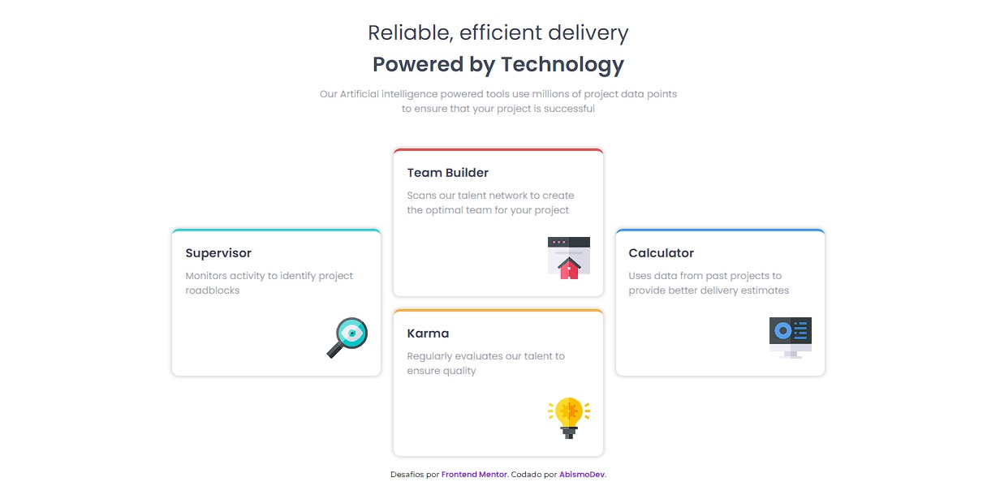

# Frontend Mentor - Four card feature section solution

This is a solution to the [Four card feature section challenge on Frontend Mentor](https://www.frontendmentor.io/challenges/four-card-feature-section-weK1eFYK). Frontend Mentor challenges help you improve your coding skills by building realistic projects. 

## Table of contents

- [Overview](#overview)
  - [The challenge](#the-challenge)
  - [Screenshot](#screenshot)
  - [Links](#links)
- [My process](#my-process)
  - [Built with](#built-with)
- [Author](#author)

## Overview

### The challenge

Users should be able to:

- View the optimal layout for the site depending on their device's screen size

### Screenshot

### Links

- Solution URL: [Solution here](https://www.frontendmentor.io/solutions/four-cards-component-responsive-flexbox-EArvcbwDmS)
- Live Site URL: [Live site here](https://four-card-component-abismodev.vercel.app/)

## My process

### Built with

- Semantic HTML5 markup
- Styled with CSS3
- Flexbox
- Responsive

## Author

- Website - In construction
- Frontend Mentor - [@AbismoDe](https://www.frontendmentor.io/profile/AbismoDev)
- Instagram - [@AbismoDev](https://www.instagram.com/abismodev)